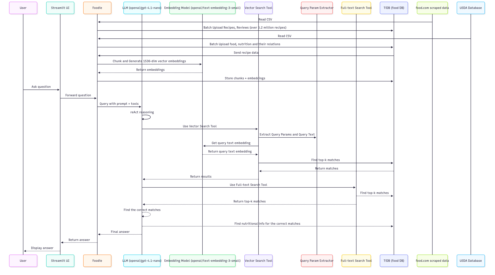

  

## Simple Explanation

The Foodie App works in **five simple steps**:

### 1. Loads the Data

- Millions of recipes(5.2M+) and reviews from **food.com**.
- Nutrition facts from the **USDA database**.

### 2. Prepares the Data

- Breaks recipes into smaller **chunks**.
- Creates **embeddings** so the app can understand meaning, not just keywords.
- Stores everything in a **database (TiDB)**.

### 3. Takes Your Question

- You ask something in the **Streamlit app**.
- The **Foodie Bot** sends your question to the AI.

### 4. Finds the Answer

- The AI uses **vector search** to find similar recipes.
- It also checks **keyword matches** with full-text search.
- Then it looks up **nutrition details** from the database.

### 5. Gives You Results

- The AI combines everything into a **clear, final answer**.
- The **UI displays** it back to you.
